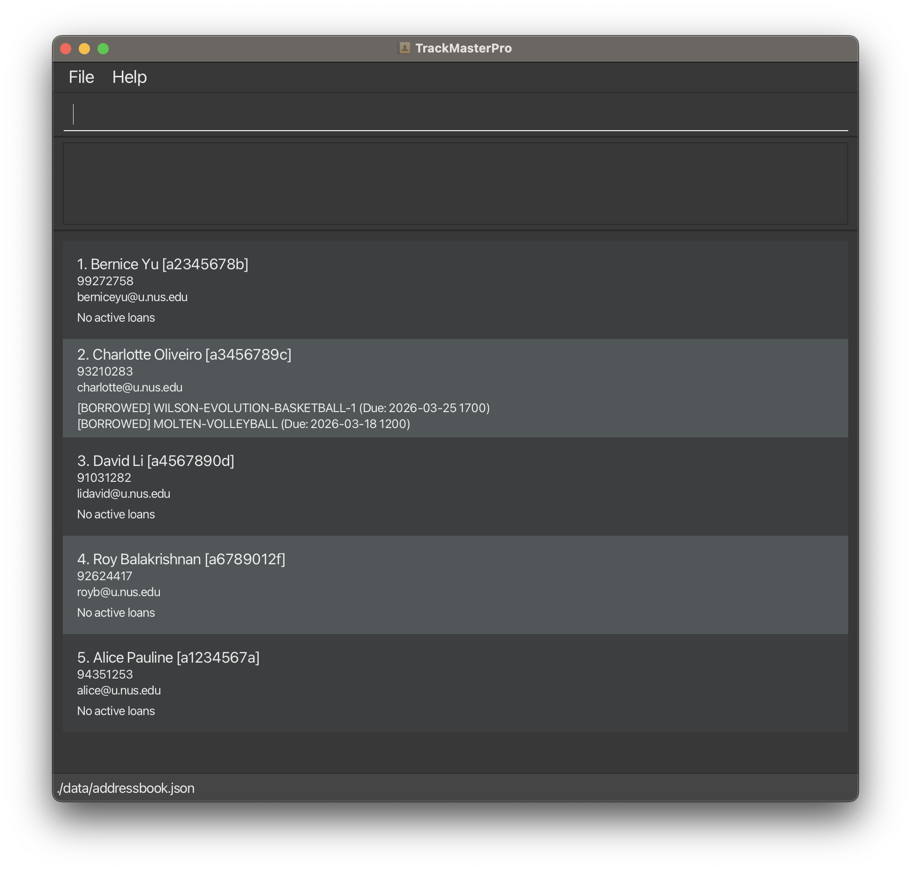

# TrackMasterPro

TrackMasterPro (TMP) is a desktop management solution tailored for Facility Managers who handle high-volume bookings and equipment tracking for CCAs, Clubs, and Halls. While it features a clean Graphical User Interface (GUI), it is optimized for those who prefer the speed of a Command Line Interface (CLI).

* Streamline tracking with assigned facilities/equipment to provide a real-time schedule during peak periods (e.g. Inter-Hall-Games/Inter-College-Games, CCA trainings etc.)
* Quick access to list of previous borrowers and details for them
* Quick access to list of facilities/equipment available
* Alerts for time sensitive events

* This eliminates the logistical chaos of peak-period facility management at NUS. It consolidates equipment tracking and venue scheduling into a single real-time view, preventing double-bookings and lost assets while giving managers instant access to borrower accountability data when it matters most.

* This project is based on the AddressBook-Level3 project, **part of the se-education.org** [initiative](https://se-education.org/#contributing-to-se-edu)
